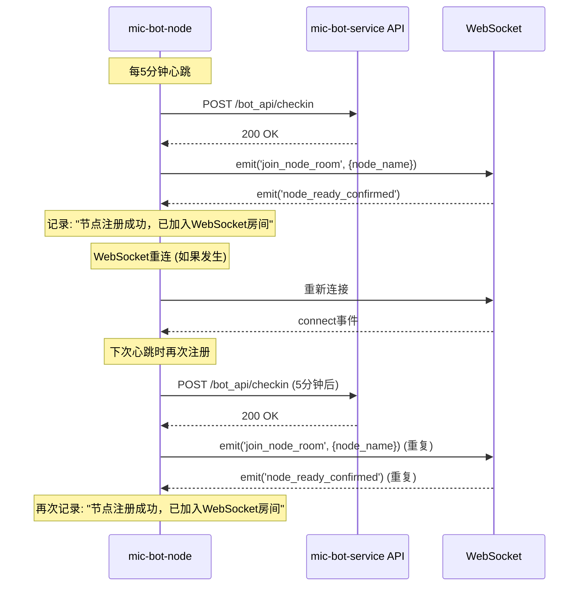

# WebSocket 重复注册问题分析报告

## 问题现象

从日志可以看到：
```
[2025/9/14 19:47:55] [PID: 1] [LOG] 主进程 [WebSocket] 📡 节点注册成功，已加入WebSocket房间
[2025/9/14 19:47:55] [PID: 1] [LOG] 主进程 [WebSocket] ✅ 节点准备就绪确认: {"node_id":9,"node_name":"ITX-node1","room_name":"node_9","message":"节点房间加入成功"}
```

## 根本原因分析

### 1. 多重触发机制

`mic-bot-node` 会在以下情况下触发 WebSocket 房间注册：

#### **A. 心跳签到触发 (主要原因)**
```typescript
// 位置: mic-bot-node/src/index.ts:1344-1397
async function checkInNode() {
    // ... 心跳签到逻辑 ...
    
    // 节点注册成功后，立即加入WebSocket房间
    if (wsClient && wsClient.connected) {
        wsClient.safeEmit('join_node_room', {
            node_name: apiConfig.nodeName
        });
        log('main', 'WebSocket', '📡 节点注册成功，已加入WebSocket房间');
    }
}

// 心跳间隔设置
const heartbeatIntervalMs = utils.stringToMs(config.apiServer?.heartbeatInterval || '5m');
setInterval(checkInNode, heartbeatIntervalMs); // 每5分钟执行一次
```

#### **B. WebSocket 重连触发**
```typescript
// 位置: mic-bot-node/src/index.ts:385-393
this.socket.on('connect', () => {
    log('main', 'WebSocket', '✅ WebSocket连接成功');
    this.isConnected = true;
    this.reconnectAttempts = 0;
    this.isReconnecting = false;
    this.processQueue(); // 处理队列中的消息
    
    // 节点准备就绪通知将在checkInNode成功后自动处理
});
```

#### **C. 服务端恢复检测触发**
```typescript
// 位置: mic-bot-node/src/index.ts:1281-1286
if (response.status === 200) {
    log('main', 'WebSocket', '✅ 检测到服务端已恢复，尝试重新连接WebSocket');
    lastWebSocketErrorTime = 0;
    
    // 重新启用WebSocket调度
    useWebSocketScheduling = true;
    if (wsClient) {
        wsClient.reconnectAttempts = 0; // 重置重连计数
        wsClient.init(); // 重新初始化WebSocket
    }
}
```

### 2. 时间间隔分析

#### **心跳间隔**
- 默认心跳间隔：5分钟 (`'5m'`)
- 每次心跳都会触发 `checkInNode()` 函数
- 每次 `checkInNode()` 成功都会发送 `join_node_room` 事件

#### **WebSocket 重连间隔**
- 基础重连间隔：10秒
- 最大重连间隔：5分钟
- 重连成功后也会触发房间加入

#### **服务端恢复检测间隔**
- 检测间隔：30秒
- 检测到恢复后会重新初始化 WebSocket

### 3. 重复注册的具体流程



## 问题影响

### 1. 日志污染
- 每5分钟就会产生重复的注册日志
- 影响日志的可读性和调试效率

### 2. 资源浪费
- 重复的房间加入操作
- 不必要的网络通信

### 3. 潜在的状态混乱
- 多次房间加入可能导致状态不一致
- 可能影响任务分发逻辑

## 解决方案

### 方案1：添加房间加入状态检查 (推荐)

```typescript
// 在 NodeWebSocketClient 类中添加状态跟踪
class NodeWebSocketClient {
    private isRoomJoined: boolean = false;
    private lastRoomJoinTime: number = 0;
    private roomJoinCooldown: number = 300000; // 5分钟冷却期
    
    /**
     * 检查是否需要加入房间
     */
    shouldJoinRoom(): boolean {
        const now = Date.now();
        return !this.isRoomJoined || (now - this.lastRoomJoinTime) > this.roomJoinCooldown;
    }
    
    /**
     * 加入节点房间
     */
    joinNodeRoom() {
        if (!this.shouldJoinRoom()) {
            log('main', 'WebSocket', '⏭️ 跳过房间加入：已在房间中或冷却期内');
            return;
        }
        
        this.safeEmit('join_node_room', {
            node_name: this.config.apiServer.nodeName
        });
        this.isRoomJoined = true;
        this.lastRoomJoinTime = Date.now();
        log('main', 'WebSocket', '📡 节点注册成功，已加入WebSocket房间');
    }
    
    /**
     * 重置房间状态（连接断开时）
     */
    resetRoomStatus() {
        this.isRoomJoined = false;
        this.lastRoomJoinTime = 0;
    }
}
```

### 方案2：修改心跳逻辑

```typescript
// 修改 checkInNode 函数
async function checkInNode() {
    // ... 现有心跳逻辑 ...
    
    // 只在首次连接或重连后加入房间
    if (wsClient && wsClient.connected && !wsClient.isRoomJoined) {
        wsClient.safeEmit('join_node_room', {
            node_name: apiConfig.nodeName
        });
        wsClient.isRoomJoined = true;
        log('main', 'WebSocket', '📡 节点注册成功，已加入WebSocket房间');
    }
}
```

### 方案3：服务端去重处理

```python
# 在 mic-bot-service 中添加房间加入去重
@socketio_instance.on('join_node_room')
def handle_join_node_room(data):
    node_id = data.get('node_id')
    node_name = data.get('node_name')
    
    # 检查是否已经在房间中
    room_name = f'node_{node.id}'
    if request.sid in socketio.manager.rooms.get(room_name, set()):
        logger.info(f'客户端 {request.sid} 已在房间 {room_name} 中，跳过重复加入')
        return
    
    # 正常加入房间逻辑...
```

## 推荐实施步骤

### 1. 立即修复 (方案1)
- 在 `NodeWebSocketClient` 类中添加房间状态跟踪
- 实现冷却期机制，避免频繁重复加入

### 2. 长期优化 (方案2)
- 修改心跳逻辑，只在必要时加入房间
- 优化重连和恢复检测逻辑

### 3. 服务端增强 (方案3)
- 在服务端添加去重处理
- 提供更详细的房间状态信息

## 预期效果

实施修复后：
- ✅ 消除重复的房间加入日志
- ✅ 减少不必要的网络通信
- ✅ 提高系统稳定性和可维护性
- ✅ 保持 WebSocket 连接的可靠性

## 总结

`mic-bot-node` 重复注册 WebSocket 房间的主要原因是：
1. **心跳机制**：每5分钟的心跳都会触发房间加入
2. **重连机制**：WebSocket 重连后也会触发房间加入
3. **恢复检测**：服务端恢复检测也会触发重新连接

通过添加房间状态跟踪和冷却期机制，可以有效解决这个问题，同时保持系统的可靠性。
