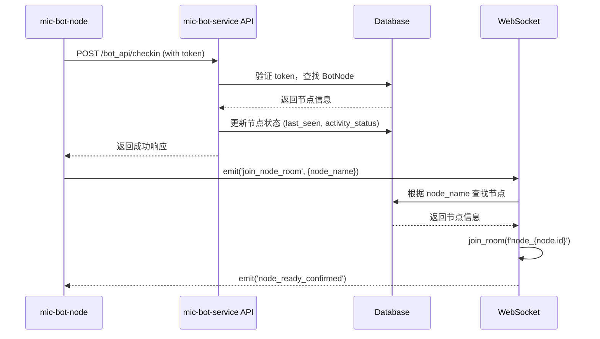

# WebSocket 房间加入标识分析报告

## 问题回答

### 1. 节点加入 WebSocket 房间用的什么做唯一标识？

**答案：使用 `node_name` 作为唯一标识**

#### 详细分析：

**mic-bot-node (客户端) 发送的数据：**
```typescript
// 位置: mic-bot-node/src/index.ts:1393-1396
wsClient.safeEmit('join_node_room', {
    node_name: apiConfig.nodeName  // 只发送 node_name
});
```

**mic-bot-service (服务端) 处理逻辑：**
```python
# 位置: mic-bot-service/project/websocket_events.py:47-67
@socketio_instance.on('join_node_room')
def handle_join_node_room(data):
    node_id = data.get('node_id')      # 通常为 None
    node_name = data.get('node_name')  # 实际使用的标识
    
    if not node_id and not node_name:
        emit('error', {'message': '节点ID或节点名称不能为空'})
        return
    
    # 根据node_name查找节点
    if node_id:
        node = BotNode.query.get(node_id)
    else:
        node = BotNode.query.filter_by(node_name=node_name).first()  # 使用 node_name 查找
    
    if not node:
        emit('error', {'message': '节点不存在'})
        return
    
    # 加入房间，房间名使用 node.id
    room_name = f'node_{node.id}'
    join_room(room_name)
```

### 2. 修改后还会出现加入失败吗？

**答案：可能会，但概率大大降低**

#### 可能失败的原因：

1. **节点名称不匹配**
   - `mic-bot-node` 配置的 `nodeName` 与数据库中的 `node_name` 不一致
   - 配置文件中的 `nodeName` 拼写错误或大小写不匹配

2. **节点未在数据库中注册**
   - 节点没有通过 HTTP API 进行过 `checkin` 操作
   - 数据库中没有对应的 `BotNode` 记录

3. **Token 认证问题**
   - 节点的 `api_token` 与数据库中的 `api_token_hash` 不匹配
   - Token 过期或配置错误

4. **数据库连接问题**
   - 数据库连接异常
   - 查询超时

#### 修改后的改进：

1. **双重查找机制**
   ```python
   # 支持通过 node_id 或 node_name 查找
   if node_id:
       node = BotNode.query.get(node_id)
   else:
       node = BotNode.query.filter_by(node_name=node_name).first()
   ```

2. **详细的错误日志**
   ```python
   logger.warning(f'客户端 {request.sid} 尝试加入不存在的节点房间: node_id={node_id}, node_name={node_name}')
   ```

3. **确认消息反馈**
   ```python
   emit('node_ready_confirmed', {
       'node_id': node.id,
       'node_name': node.node_name,
       'room_name': room_name,
       'message': '节点房间加入成功'
   })
   ```

## 节点认证和注册流程

### 1. 节点注册流程



### 2. 认证机制

**HTTP API 认证：**
```python
# 位置: mic-bot-service/project/auth.py:6-14
def check_bot_token(token):
    nodes = BotNode.query.all()
    for node in nodes:
        if check_password_hash(node.api_token_hash, token):
            g.node = node  # 设置全局节点对象
            return True
    return False
```

**WebSocket 认证：**
```typescript
// 位置: mic-bot-node/src/index.ts:349-353
this.socket = io(serverUrl, {
    auth: {
        token: this.config.apiServer.token,
        nodeName: this.config.apiServer.nodeName
    },
    // ... 其他配置
});
```

## 故障排查指南

### 1. 检查节点配置

```bash
# 检查 mic-bot-node 配置
cat mic-bot-node/node-1/config.json | jq '.apiServer'
```

确保配置正确：
```json
{
  "apiServer": {
    "enabled": true,
    "updateUrl": "http://your-server:2003/",
    "token": "your-correct-token",
    "nodeName": "node-1"  // 确保这个名称正确
  }
}
```

### 2. 检查数据库记录

```sql
-- 检查节点是否在数据库中
SELECT id, node_name, api_token_hash, status FROM bot_nodes;

-- 检查节点名称是否匹配
SELECT * FROM bot_nodes WHERE node_name = 'node-1';
```

### 3. 检查日志

```bash
# 检查 WebSocket 连接日志
docker-compose logs api | grep -E "(join_node_room|节点不存在|WebSocket错误)"

# 检查节点日志
docker-compose logs node-1 | grep -E "(WebSocket|join_node_room|节点注册)"
```

### 4. 常见问题解决

#### 问题1：节点名称不匹配
```bash
# 解决方案：确保配置文件中的 nodeName 与数据库中的 node_name 一致
# 或者重新创建节点记录
```

#### 问题2：Token 不匹配
```bash
# 解决方案：重新生成 token 并更新配置
# 或者检查 token 是否正确配置
```

#### 问题3：节点未注册
```bash
# 解决方案：确保节点先通过 HTTP API 进行 checkin
# 检查 /bot_api/checkin 接口是否正常工作
```

## 总结

1. **唯一标识**：使用 `node_name` 作为 WebSocket 房间加入的唯一标识
2. **失败概率**：修改后失败概率大大降低，但仍可能因配置错误而失败
3. **关键因素**：
   - 节点名称配置正确
   - 节点已在数据库中注册
   - Token 认证通过
   - 数据库连接正常

4. **建议**：
   - 确保配置文件中的 `nodeName` 与数据库中的 `node_name` 完全一致
   - 定期检查节点注册状态
   - 监控 WebSocket 连接日志
   - 实现自动重连机制
