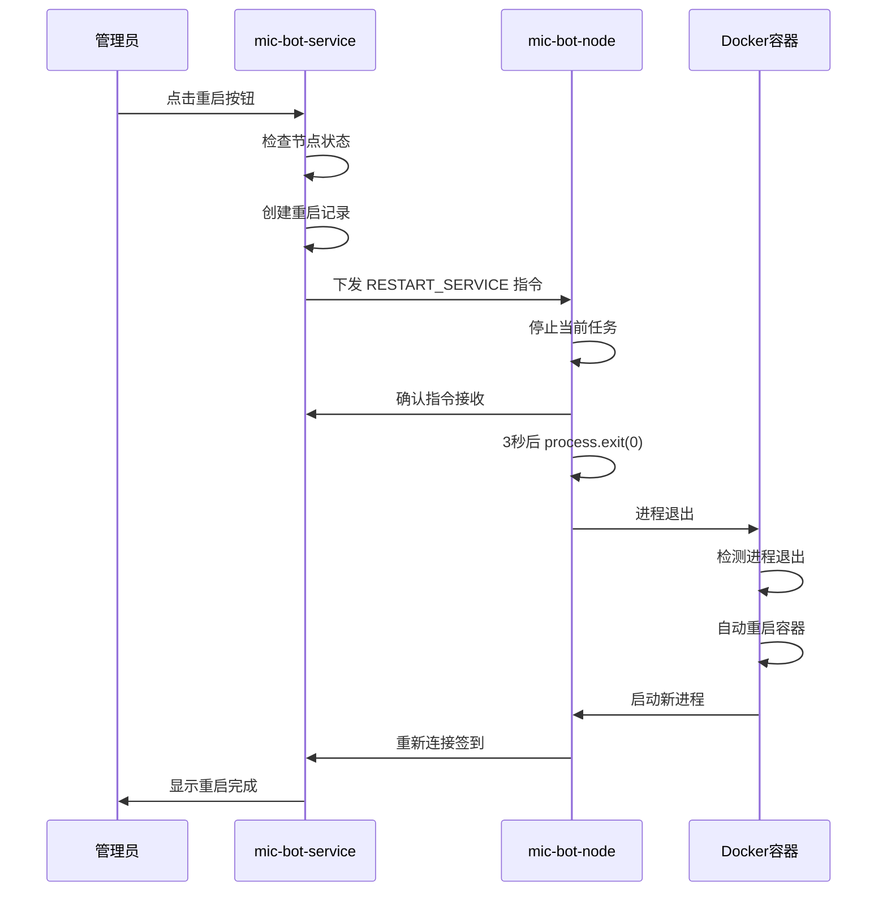

# 节点重启功能使用说明

## 功能概述

节点重启功能允许管理员通过 Web 界面远程重启 mic-bot-node 节点服务。这是一个重要的管理功能，特别适用于：

- 节点出现异常需要重启恢复
- 应用更新后需要重启节点
- 内存泄漏或性能问题需要重启
- 配置更改后需要重启生效

## 功能特性

### ✅ 已实现的功能

1. **Web 界面重启**
   - 在节点管理页面点击重启按钮
   - 详细的确认对话框和说明
   - 实时重启状态监控

2. **安全重启流程**
   - 检查节点在线状态
   - 优雅停止当前任务
   - 3秒延迟后退出进程
   - Docker 容器自动重启

3. **完整的日志记录**
   - 重启操作日志
   - 重启历史记录
   - 操作人员记录
   - 重启耗时统计

4. **推送通知**
   - 重启开始通知
   - 重启完成通知
   - 异常情况通知

5. **状态监控**
   - 实时监控重启进度
   - 自动检测重启完成
   - 超时处理机制

## 使用方法

### 1. 通过 Web 界面重启

1. 登录 mic-bot-service 管理界面
2. 导航到"节点管理"页面
3. 找到需要重启的节点
4. 点击节点操作栏中的"重启服务"按钮（橙色刷新图标）
5. 在确认对话框中点击"确认重启"
6. 等待重启完成（通常 10-30 秒）

### 2. 重启确认对话框

重启确认对话框包含以下信息：
- 节点名称
- 重启说明和注意事项
- 任务中断警告
- 重启时间预估

### 3. 重启状态监控

重启过程中会显示：
- 重启指令下发状态
- 节点重启进度
- 自动检测重启完成
- 超时处理（60秒）

## 技术实现

### 重启流程



### API 接口

#### 重启节点
```http
POST /web_api/nodes/{node_id}/restart
Authorization: Bearer {token}
```

#### 获取节点详情
```http
GET /web_api/nodes/{node_id}
Authorization: Bearer {token}
```

#### 获取重启历史
```http
GET /web_api/nodes/{node_id}/restart-history
Authorization: Bearer {token}
```

### 数据库表结构

#### node_restart_history 表
```sql
CREATE TABLE node_restart_history (
    id SERIAL PRIMARY KEY,
    node_id INTEGER NOT NULL,
    restart_time TIMESTAMP WITH TIME ZONE NOT NULL DEFAULT NOW(),
    restart_reason VARCHAR(100) NOT NULL DEFAULT 'manual_restart',
    restarted_by VARCHAR(100),
    restart_duration INTEGER,
    status VARCHAR(20) NOT NULL DEFAULT 'success',
    notes TEXT,
    FOREIGN KEY (node_id) REFERENCES bot_nodes(id) ON DELETE CASCADE
);
```

## 注意事项

### ⚠️ 重要提醒

1. **任务中断**
   - 重启会立即中断正在执行的任务
   - 建议在节点空闲时进行重启
   - 重要任务执行前避免重启

2. **数据安全**
   - 会话数据通过 volume 挂载，重启后不丢失
   - 配置文件为只读挂载，重启后保持
   - 日志数据会保留

3. **网络连接**
   - 重启过程中节点会短暂离线
   - 重启完成后会自动重新连接
   - 如果重启失败，需要手动检查

4. **容器配置**
   - 确保 Docker 容器配置了 `restart: unless-stopped`
   - 容器会自动重启，无需手动干预

### 🔧 故障排除

#### 重启失败
1. 检查节点是否在线
2. 检查网络连接
3. 查看节点日志
4. 检查 Docker 容器状态

#### 重启超时
1. 等待更长时间（最多60秒）
2. 手动检查节点状态
3. 查看容器日志
4. 必要时手动重启容器

#### 节点无法重新连接
1. 检查 mic-bot-service 状态
2. 检查网络连接
3. 验证 API Token
4. 查看节点配置

## 配置要求

### mic-bot-service 配置
- 数据库已升级到 v2.11
- 推送通知功能已配置
- Web 界面访问正常

### mic-bot-node 配置
- Docker 容器配置 `restart: unless-stopped`
- API 服务器连接正常
- 长轮询功能正常

### Docker 配置示例
```yaml
services:
  node-1:
    image: local/bot-node-base:latest
    container_name: mic-bot-node-1
    restart: unless-stopped  # 重要：确保自动重启
    volumes:
      - ./node/node-1/config.json:/app/config.json:ro
      - ./node/node-1/sessions:/app/sessions
```

## 更新日志

### v2.11 (2024-12-19)
- ✅ 添加节点重启历史记录功能
- ✅ 增强重启状态监控
- ✅ 改进用户界面和体验
- ✅ 添加推送通知支持
- ✅ 完善错误处理和日志记录

## 支持

如果在使用过程中遇到问题，请：

1. 查看节点日志
2. 检查服务端日志
3. 验证网络连接
4. 确认配置正确性

---

*最后更新：2024-12-19*
