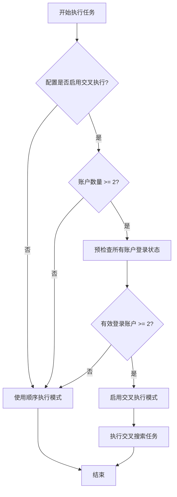
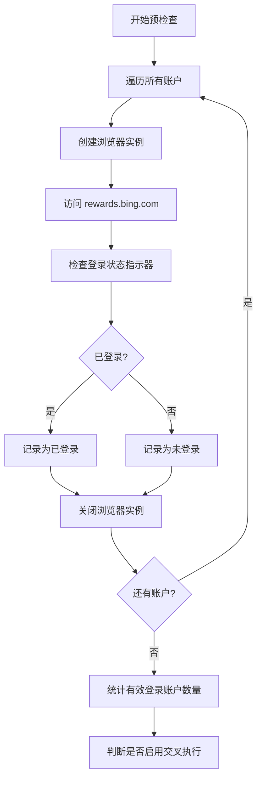
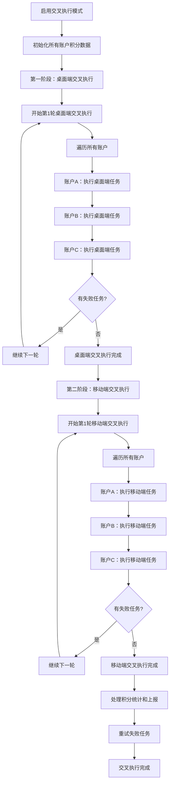
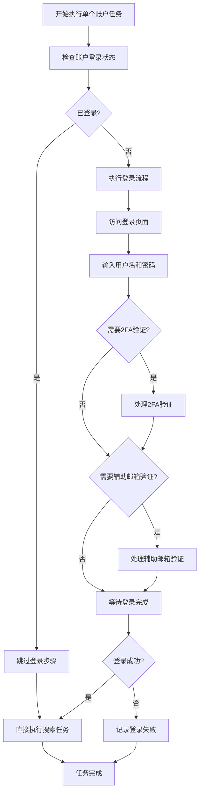
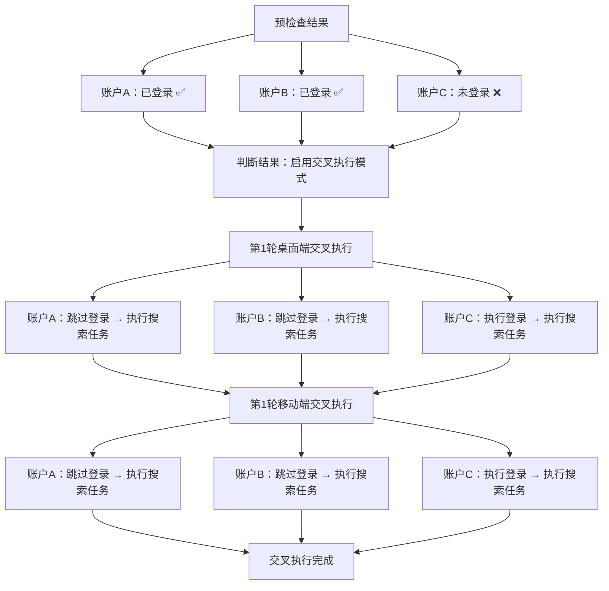
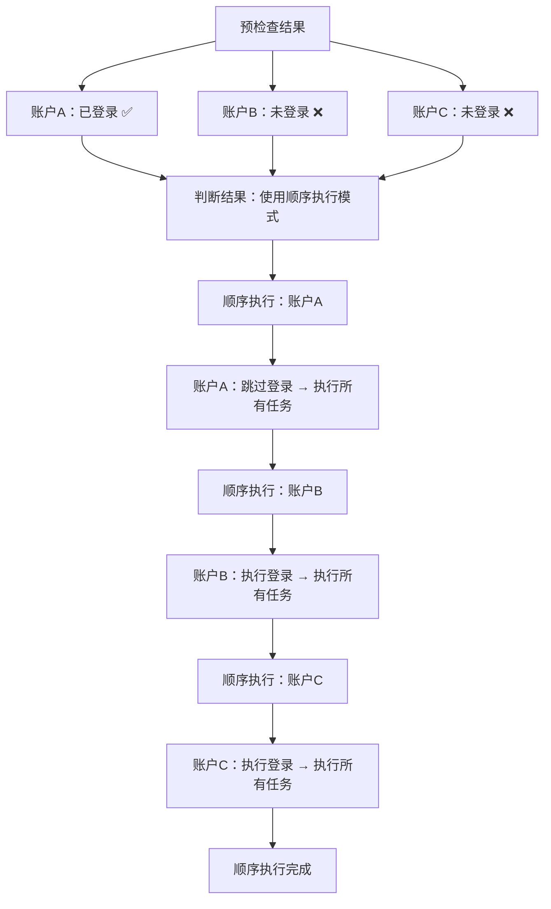
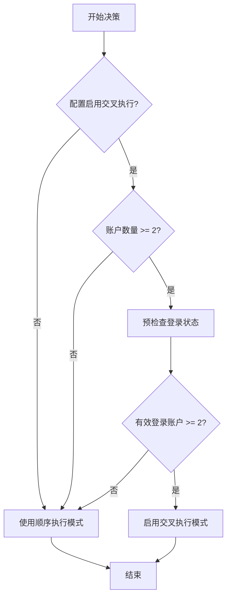
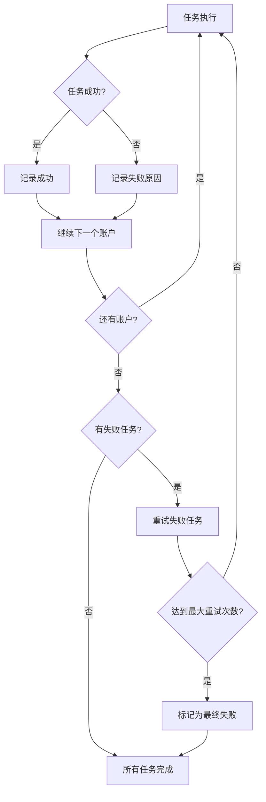

# 搜索任务交叉执行 Mermaid 流程图

## 整体执行流程

## 预检查阶段详细流程

## 交叉执行模式详细流程

## 单个账户任务执行流程（包含登录）

## 场景示例：3个账户，2个已登录，1个未登录

## 场景示例：3个账户，只有1个已登录

## 决策点流程图

## 错误处理和重试机制

---

*Mermaid 流程图版本: 1.0*
*创建日期: 2024-12-19*
*最后更新: 2024-12-19*
